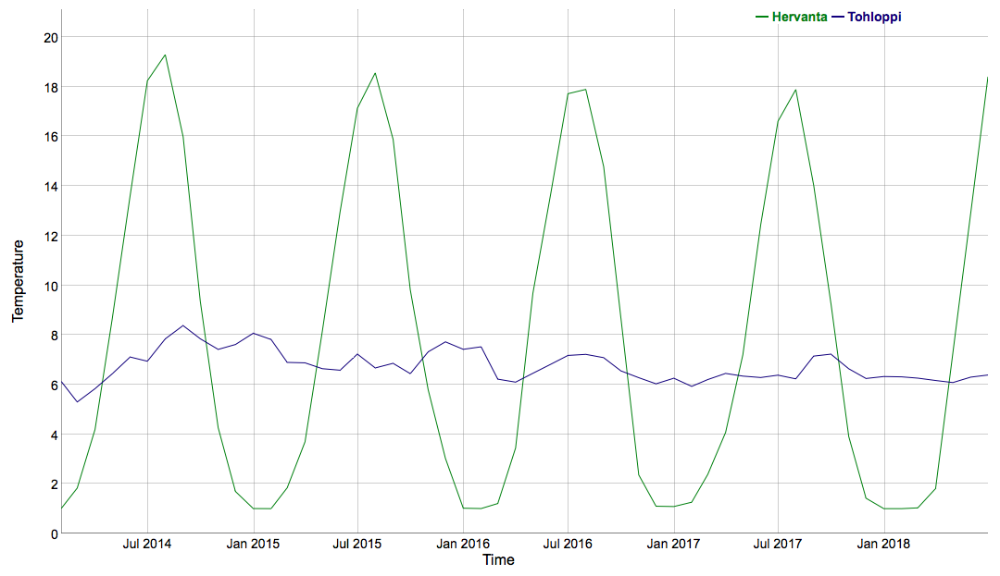
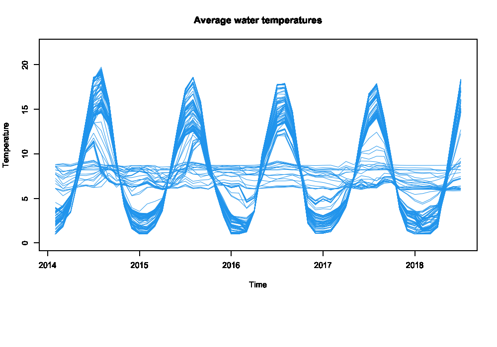

# Data visualization of drinking water temperatures in Tampere

Tampere Water measures quality of drinking water and offers the measurements through public [API](https://vellamo.tampere.fi/about#dev). This repository contains R scripts for downloading the data and creating some visualizations.

## Examples





## Getting started

You need to have R and R studio installed:
```
brew install r
brew cask install rstudio
```

### Running the scripts
To download latest data from the API, use the `data_loader.R` script:
```
cd src
Rscript data_loader.R
```
Once you have the data ready, open `visualizations.R` in R studio and run the code line by line to view different plots.
